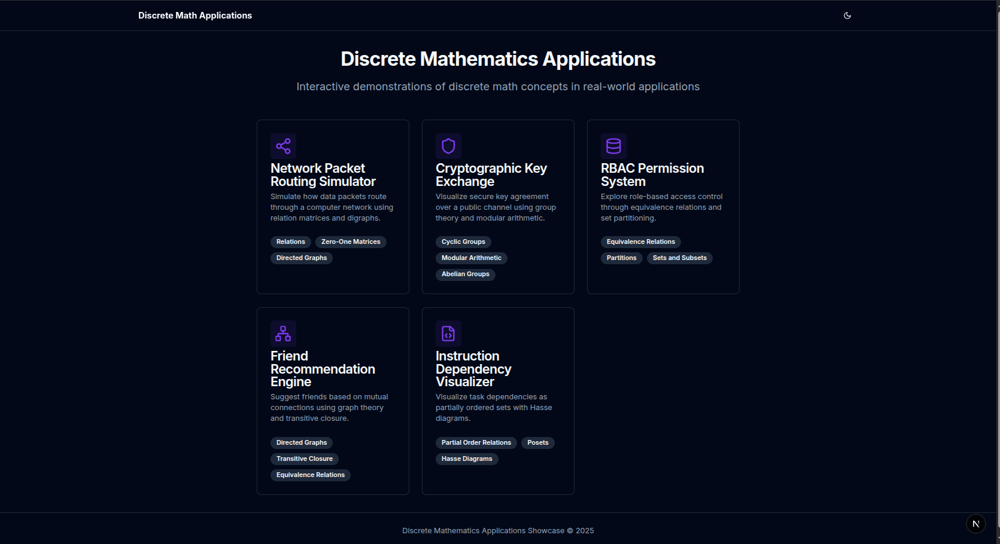

# Discrete Mathematics Showcase

An interactive web application demonstrating key concepts from discrete mathematics through visual and interactive examples. This project showcases how abstract mathematical concepts can be applied to computer science problems.



## Features

- **Instruction Dependency Visualizer**: Explore partial order relations and Hasse diagrams through a 3D visualization of instruction dependencies in a compiler pipeline
- **Interactive 3D Visualizations**: Manipulate and interact with mathematical structures in 3D space
- **Topological Sorting**: Generate and view all valid execution sequences for a given set of dependencies
- **Educational Content**: Learn about the mathematical theory behind each visualization

## Technology Stack

- **Framework**: Next.js (App Router)
- **UI Components**: Shadcn UI
- **3D Rendering**: Three.js with React Three Fiber and Drei
- **Package Manager**: pnpm
- **Language**: TypeScript

## Getting Started

### Prerequisites

- Node.js (v16.8 or higher)
- pnpm (v7 or higher)

### Installation

1. Clone the repository:

```bash
git clone https://github.com/yourusername/discrete-math-showcase.git
cd discrete-math-showcase
```

2. Install dependencies with pnpm:

```bash
pnpm install
```

3. Start the development server:

```bash
pnpm dev
```

4. Open [http://localhost:3000](http://localhost:3000) in your browser to see the application.

## Available Scripts

- `pnpm dev` - Start the development server
- `pnpm build` - Build the application for production
- `pnpm start` - Start the production server
- `pnpm lint` - Run ESLint to check for code quality issues

## Project Structure

```
discrete-math-showcase/
├── app/                  # Next.js App Router
│   ├── compiler/         # Instruction Dependency Visualizer
│   ├── layout.tsx        # Root layout
│   └── page.tsx          # Home page
├── components/           # Reusable UI components
│   ├── page-layout.tsx   # Layout component for all pages
│   └── ui/               # UI components from shadcn/ui
├── public/               # Static assets
└── README.md             # Project documentation
```

## Mathematical Concepts Covered

### Partial Order Relations

A partial order relation is a binary relation that is reflexive, antisymmetric, and transitive. In the context of instruction dependencies, this relation represents "must execute before" constraints between instructions.

### Hasse Diagrams

Hasse diagrams provide a graphical representation of partially ordered sets, showing the direct relationships between elements while omitting reflexive and transitive relationships.

### Topological Sorting

Topological sorting is an algorithm for linearly ordering the vertices of a directed acyclic graph (DAG) such that for every directed edge (u, v), vertex u comes before vertex v in the ordering.

## Contributing

Contributions are welcome! Feel free to open an issue or submit a pull request if you have ideas for improvements or new visualizations.

1. Fork the repository
2. Create your feature branch: `git checkout -b feature/amazing-feature`
3. Commit your changes: `git commit -m 'Add some amazing feature'`
4. Push to the branch: `git push origin feature/amazing-feature`
5. Open a pull request

## License

This project is licensed under the MIT License - see the LICENSE file for details.

## Acknowledgements

- [Next.js](https://nextjs.org/)
- [React Three Fiber](https://github.com/pmndrs/react-three-fiber)
- [Shadcn UI](https://ui.shadcn.com/)
- [Three.js](https://threejs.org/)
